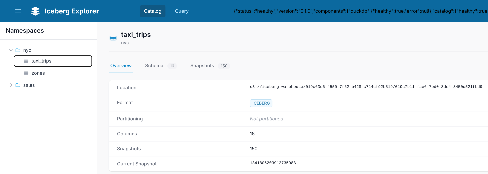

# Iceberg Explorer

High-performance web application for interactive exploration of Apache Iceberg data lakes.

## Features

- Browse Iceberg catalog namespaces and tables
- View table schema, partitioning, and snapshot history
- Execute SQL queries against Iceberg tables using DuckDB
- Export query results to CSV
- Real-time streaming of query results

## Tech Stack

- **Backend**: FastAPI, DuckDB (with Iceberg extension), Granian
- **Frontend**: HTMX, Alpine.js, Tailwind CSS
- **Observability**: OpenTelemetry, structlog

## Quick Start (Docker)

Run the latest image from GHCR:

```bash
docker run --rm -p 8080:8080 \
  -e ICEBERG_EXPLORER_CATALOG__TYPE=rest \
  -e ICEBERG_EXPLORER_CATALOG__URI=http://<catalog-host>:8181 \
  -e ICEBERG_EXPLORER_CATALOG__NAME=default \
  ghcr.io/davzucky/iceberg-explorer:latest
```

Open `http://localhost:8080` in your browser.

### Environment Variables

These are the main environment variables end users typically set when running with Docker.

| Variable | Required | Description |
| --- | --- | --- |
| `ICEBERG_EXPLORER_CATALOG__TYPE` | Yes | Catalog type: `rest` (default) or `local`. |
| `ICEBERG_EXPLORER_CATALOG__URI` | Yes for `rest` | REST catalog endpoint (for example, `http://lakekeeper:8181`). |
| `ICEBERG_EXPLORER_CATALOG__WAREHOUSE` | Yes for `local` | Warehouse location for local catalog mode. |
| `ICEBERG_EXPLORER_CATALOG__NAME` | No | DuckDB attachment name (default: `default`). |
| `ICEBERG_EXPLORER_CATALOG__TOKEN` | No | Bearer token for authenticated REST catalogs. |
| `ICEBERG_EXPLORER_CATALOG__CREDENTIAL` | No | Catalog credential string when required by your catalog. |
| `ICEBERG_EXPLORER_CATALOG__S3__ENDPOINT` | No | S3-compatible endpoint URL for table data access. |
| `ICEBERG_EXPLORER_CATALOG__S3__ACCESS_KEY_ID` | No | S3 access key ID. |
| `ICEBERG_EXPLORER_CATALOG__S3__SECRET_ACCESS_KEY` | No | S3 secret access key. |
| `ICEBERG_EXPLORER_CATALOG__S3__REGION` | No | S3 region. |
| `ICEBERG_EXPLORER_SERVER__PORT` | No | HTTP server port inside the container (default: `8080`). |

## Screenshot



## Development

### Prerequisites

- Python 3.11+
- [uv](https://docs.astral.sh/uv/) package manager

### Setup

```bash
# Install dependencies
uv sync --all-extras

# Run tests
uv run pytest

# Run linting
uv run ruff check src/

# Start development server
uv run iceberg-explorer
```

## CI/CD and Releases

### Continuous Integration

The `CI` workflow runs on pull requests and pushes to `main` and performs:

- Dependency install with `uv` (locked via `uv.lock`)
- Linting (`ruff check`)
- Tests (`pytest`)
- Lakekeeper/MinIO/Postgres service startup checks via Docker Compose
- Docker image build validation

### Release Workflow

The `Release` workflow supports two paths:

1. Push a tag in the format `vX.Y.Z`
2. Manually run the workflow (`workflow_dispatch`) to create the tag from `pyproject.toml`

Release behavior:

- Verifies tag version matches `pyproject.toml`
- Builds and publishes a Python wheel
- Builds Docker image and scans with Trivy (fails on `HIGH,CRITICAL`)
- Pushes image to GHCR only after Trivy passes
- Creates GitHub Release with auto-generated release notes
- Opens a PR to bump version to the next patch (`X.Y.Z -> X.Y.(Z+1)`)

### Manual Release Steps

1. Ensure `project.version` in `pyproject.toml` is the version you want to release
2. Open GitHub Actions and run the `Release` workflow
3. Leave `ref` as `main` (or choose a specific commit/branch)
4. Confirm the workflow completes successfully

### PyPI Trusted Publishing Setup (one-time)

Configure Trusted Publishing in your PyPI project:

1. Go to PyPI project settings -> Publishing -> Add a new trusted publisher
2. Set owner to `davzucky`
3. Set repository to `iceberg-explorer`
4. Set workflow name to `release.yml`
5. Set environment name only if you enforce one in GitHub Actions

No PyPI API token is needed when Trusted Publishing is configured correctly.

### Pre-commit Hooks

```bash
# Install pre-commit hooks
uv run pre-commit install
```

## License

MIT
